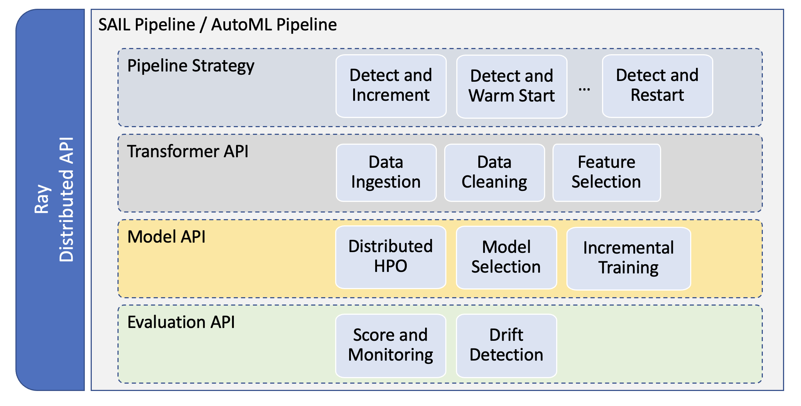
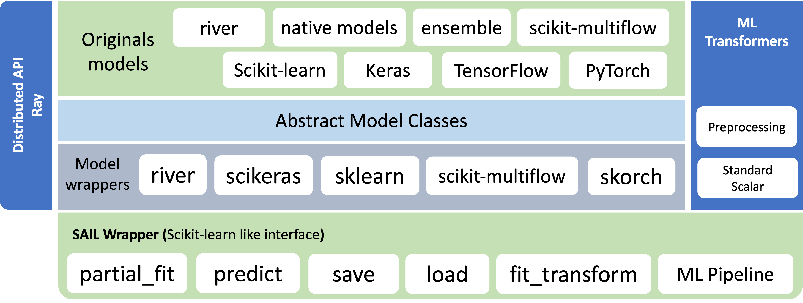

# SAIL

[](https://opensource.org/licenses/MIT)  [](https://www.python.org/downloads/) </a>

The library is for experimenting with streaming processing engines (SPEs) and incremental machine learning (IML) models. The main features of Sail are:

- Common interface for all incremental models available in libraries like Scikit-Learn, Pytorch, Keras and River.
- Distributed computing for model selection, ensembling etc.
- Hyperparameter optimization for incremental models (TODO).
- Interface and pipelines that implement incremental models for both offline and online learning.

## Full Documentation

See the [**SAIL Wiki**](https://github.com/IBM/sail/wiki) for full documentation, installation guide, operational details and other information.

## SAIL Architecture



## SAIL Model Framework



## Difference with River and other existing incremental machine learning libraries.

Sail leverages the existing machine learning libraries like River, sklearn etc and creates a common set of APIs to run these models in the backend. In particular, while River provides minimal utilities for deep learning models, it does not focus on deep learning models developed through Pytorch and Keras. In addition, models in Sail are parallelized using Ray. The parallelization results in three major advatages that are particularly important for incremental models with high volume and high velocity data:

- Faster computational times for ensemble models.
- Faster computational times for ensemble of forecasts.
- Creates a clean interface for developing AutoML algorithms for incremental models.

## Spark vs Ray for incremental models.

Sail could have been parallelized using Spark as well. However, to keep the streaming processing engines and machine learning tasks independent, Ray was preferred as the data can then be handled using Pandas, Numpy etc efficiently. This flexibility further allows using other SPEs like Flink or Storm without updating the parallelization framework for IML models.

## 🛠 Installation

Sail is intended to work with **Python 3.8 and above**. You can install the latest version from GitHub as so:

```sh
git clone https://github.com/IBM/sail.git
cd sail
pip install -e ".[OPTION]"
```

Supported `OPTION` include:

- tensorflow
- tensorflow_arm64
- pytorch
- river
- ray
- dev
- tests
- examples : to run notebooks and examples
- all : all of the above
- all_arm64 : Apple ARM64 version all of the above

Sail has an additional dependency on Scikit-Multiflow which can be installed as follows:

```sh
pip install scikit-multiflow==0.5.3
```

## ✍️ Examples and Notebooks

Examples and notebooks are located in the `examples` and `notebook` respectively. Please run the below command to install the necessary packages to run examples.

```sh
pip install -e ".[examples]"
```

## Acknowledgment

This project has received funding from the European Union’s Horizon 2020 research and innovation programme under grant agreement No 957345 for MORE project.
